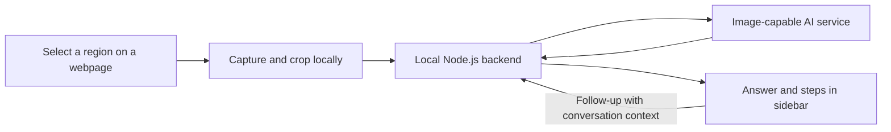

# Scan-and-Solve

A Chrome extension that lets you drag a box around a question on a webpage and see the answer, a step-by-step explanation, and follow-up chat in the browser sidebar.

**Status:** Active prototype. The extension, drag-to-scan capture flow, sidebar, local server, and demo response path are implemented. The next milestone is connecting a vision-capable AI provider so selected questions receive real answers. This first version is for personal testing before a public release.

## The experience

1. Open a webpage containing a question.
2. Activate the extension using its toolbar icon or a keyboard shortcut.
3. Drag a box around the complete question, including any diagrams or answer choices.
4. Release to automatically capture, crop, and submit that area.
5. Read the answer and explanation in the sidebar.
6. Ask follow-up questions without leaving the page.

There is no need to manually take, save, or upload a screenshot. The extension captures the selected area behind the scenes. Dragging a box gives the user control over what is included; automatic question detection on hover is outside the first version.

## Answer layout

The answer appears at the top, followed immediately by the full explanation. Steps are visible without expanding a section or clicking another button.

```text
┌──────────────────────────────────────┐
│ Answer: x = 4                        │
│                                      │
│ Step-by-step solution                │
│ Solve: 2x + 3 = 11                   │
│                                      │
│ 1. Subtract 3 from both sides.        │
│    This isolates the term with x.    │
│    2x = 8                            │
│                                      │
│ 2. Divide both sides by 2.            │
│    This leaves x by itself.          │
│    x = 4                             │
│                                      │
│ 3. Check: 2(4) + 3 = 11.             │
│                                      │
│ Ask a follow-up question…            │
└──────────────────────────────────────┘
```

Each step should explain what to do and why. Answers should support readable equations, lists, and code where relevant. If the image is incomplete or unclear, the assistant should ask for clarification instead of inventing missing information.

## Technology plan

| Part | Technology | Purpose |
| --- | --- | --- |
| Extension | TypeScript + Chrome Manifest V3 | Browser integration, permissions, and capture coordination |
| Sidebar | React + TypeScript | Answer display, captured-image preview, and follow-up chat |
| Styling | HTML + CSS | Layout, typography, and interaction states |
| Capture | Chrome screenshot API + browser Canvas API | Capture the visible tab and crop the selected region locally |
| Backend | TypeScript + Node.js | Validate requests, call the AI service, and return responses |
| AI | An image-capable AI service; provider/model to be selected | Interpret the selected question and generate a solution |
| Preferences | Chrome local storage | Remember settings on the user's browser |
| Shared contracts | TypeScript definitions and runtime validation | Keep extension and backend requests consistent |

TypeScript will be used across the extension and backend. Python and a database are not required for the initial prototype.

## Architecture



### Extension components

- **Manifest and entry points:** Define the toolbar action, shortcut, sidebar, and required permissions.
- **Selection overlay:** Draw the selection rectangle, allow cancellation with Escape, and reject empty selections.
- **Capture and cropping:** Remove the overlay before capture, crop accurately at different zoom levels and screen resolutions, and send only the selected crop to the backend. Coordinate sidebar opening so changes to page width do not invalidate the selection.
- **Background coordinator:** Handle toolbar/shortcut events and messages between the webpage and sidebar. Treat the Manifest V3 service worker as an event-driven coordinator rather than a permanently running process.
- **Sidebar:** Show the captured question, answer-first solution, follow-up conversation, loading state, cancellation, retry, copy answer, and new-conversation controls.
- **Preferences:** Store local settings. Saved conversation history is optional and not required for the first milestone.

### Backend components

- **Request API:** Accept a selected image or follow-up message and validate image type, size, and request structure.
- **AI adapter:** Keep provider-specific calls separate from the rest of the application so the model can be changed after testing.
- **Solution instructions:** Request an answer followed by clear steps and reasons. Preserve context for follow-up questions.
- **Response handling:** Return responses progressively where supported and handle failures, timeouts, and cancellation.
- **Secret management:** Read the AI API key from server-side configuration, never from bundled extension code or committed files.

### Image understanding

The first version will send the cropped image directly to an image-capable model. A separate OCR stage is not required initially; preserving the image helps retain equation layout, graphs, diagrams, and answer choices.

OCR can be evaluated later for searchable text, highlighting, or selecting individual questions. The model's interpretation of a question is not a verified transcription, and generated solutions still need accuracy testing.

## Repository structure

```text
scan-and-solve/
├── extension/
│   ├── manifest.json
│   ├── sidebar/          # Image preview, answer, explanation, and chat
│   ├── capture/          # Selection overlay and local cropping
│   ├── background/       # Toolbar, shortcuts, and message coordination
│   └── settings/         # User preferences
├── server/
│   ├── api/              # Image and conversation endpoints
│   ├── ai/               # Provider integration and solution instructions
│   └── validation/       # Request and file validation
├── shared/               # Request/response definitions
├── tests/
└── README.md
```

## First-version scope

### Included

- Chrome on desktop, installed locally for personal use.
- Toolbar and keyboard activation.
- Drag-to-scan with automatic submission on release.
- Cropped-image preview in the sidebar.
- **Answer:** at the top, followed by the full step-by-step explanation.
- Follow-up chat that retains the current question's context.
- Equation and code formatting where needed.
- Loading, cancellation, retry, copy answer, and start-over behavior.
- A locally running backend connected to an online AI service.

### Optional fallback

Pasting or uploading an image can provide a fallback when browser restrictions prevent selection on a particular page. It is not the primary scan interaction, and its inclusion can be decided during implementation.

### Deferred

- Hover-based automatic question detection.
- Camera and phone scanning.
- Other browsers and mobile support.
- Standalone OCR or locally hosted AI models.
- Web search and source-backed answers; these are separate from generating a solution from an image.
- Accounts, payments, cloud history, and cross-device synchronization.
- Public store distribution and a publicly hosted backend.

## Privacy and local development

- Prefer temporary tab access through `activeTab`, with only the additional permissions needed for selection, the sidebar, local preferences, and backend communication.
- Capture only after an explicit user action. Do not continuously monitor pages.
- Crop locally before transmission; send the selected region rather than the full page capture.
- Keep AI credentials on the backend and exclude secret configuration from Git.
- Bind the prototype backend to the local machine and validate requests; it is not intended to be a public, unauthenticated service.
- Avoid retaining question images or logging their contents by default.

The prototype is **not offline**: the local backend sends the selected crop and relevant conversation context to the chosen AI provider. Provider data policies and API costs must be reviewed when selecting that service.

## Build milestones

| Stage | Deliverable | Completion check |
| --- | --- | --- |
| 1. Extension and interface | Locally installable extension with a React sidebar and sample answer | **Implemented:** toolbar opens the sidebar; answer-first layout and follow-up input are usable |
| 2. Drag-to-scan | Selection overlay, cancellation, capture, cropping, and preview | **Implemented:** drag selection, local crop, preview, and Escape cancellation are built; manual browser testing remains |
| 3. AI connection | Local Node.js backend and a selected vision model | A real selected question produces an answer and explanation; credentials stay server-side |
| 4. Chat and reliability | Contextual follow-ups, formatting, retry, cancellation, and error handling | Follow-ups refer to the correct question and failures leave the interface usable |
| 5. Personal testing | Representative question set and browser checks | Document accuracy, incomplete-input behavior, response time, and approximate API cost |
| 6. Public-release preparation | Hosted backend, access controls, usage limits, and distribution materials | Address the public-release requirements below before opening access |

## Testing plan

- Check selection coordinates at different browser zoom levels, display scaling settings, and scroll positions.
- Check that the overlay is absent from the final crop and sidebar resizing does not shift the capture.
- Test Escape, tiny selections, repeated scans, tab changes, and starting a new conversation.
- Test supported webpages and explain restrictions gracefully on unsupported pages.
- Verify mathematical formatting, code blocks, long explanations, and narrow sidebar layouts.
- Test network failures, invalid images, AI errors, timeouts, and cancellation.
- Verify that follow-up messages retain the intended question's context.
- Evaluate known-answer questions, diagrams, multiple-choice questions, and incomplete or blurry inputs. Refine the evaluation set once the initial subject focus is chosen.
- Confirm no API keys are bundled into the extension and only the selected image is transmitted.

## Before a public release

- Host the backend securely over HTTPS.
- Add authentication or another controlled-access mechanism, rate limits, usage quotas, and cost monitoring.
- Decide whether accounts and persistent history are needed; add a database only if required.
- Document what data is transmitted, retained, and shared with the AI provider.
- Prepare store assets, permission explanations, privacy information, and installation/support documentation.
- Complete broader compatibility and abuse testing before inviting public users.

## Decisions still open

- Initial question focus: primarily schoolwork/math or broader webpage questions.
- AI provider and model, selected using accuracy, response time, and cost tests.
- Exact keyboard shortcut and visual styling.
- Whether image paste/upload and local conversation history belong in the first release.
- Hosting, account design, and pricing for a future public version.

## Run the prototype

Requirements: Chrome 116 or newer and Node.js 22.6 or newer.

1. Install dependencies and create the extension build:

   ```bash
   npm install
   npm run build
   ```

2. In Chrome, open `chrome://extensions`, turn on **Developer mode**, choose **Load unpacked**, and select the `extension/dist` directory.

3. Start the local server from the repository root:

   ```bash
   npm start --workspace server
   ```

4. Open a normal webpage, click the **Scan & Solve** toolbar icon, drag around a question, and release.

The current server runs in demo mode. It confirms that the selected crop reached the server and returns a sample step-by-step response; it does not interpret the question yet.

For development, `npm run dev` watches the extension files and restarts the server when code changes. After an extension rebuild, click **Reload** for Scan & Solve on `chrome://extensions`.

## Project checks

```bash
npm run typecheck
npm test
npm run build
```

Tests currently cover image-coordinate scaling and server request validation. Manual browser checks are still required for Chrome permission behavior, selection appearance, and capture accuracy across display settings.
